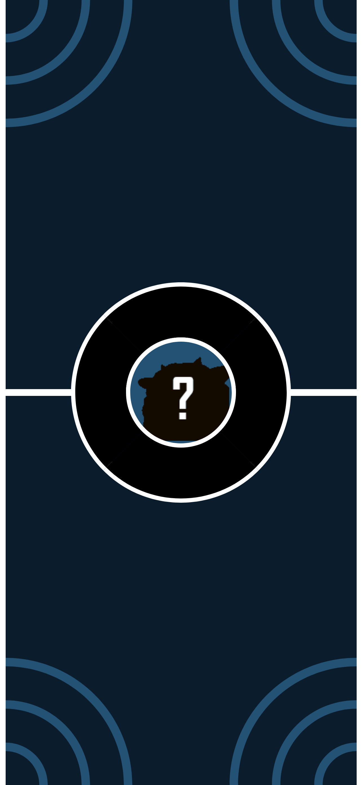
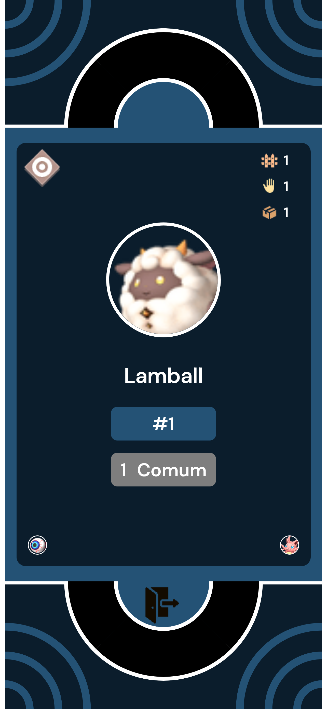
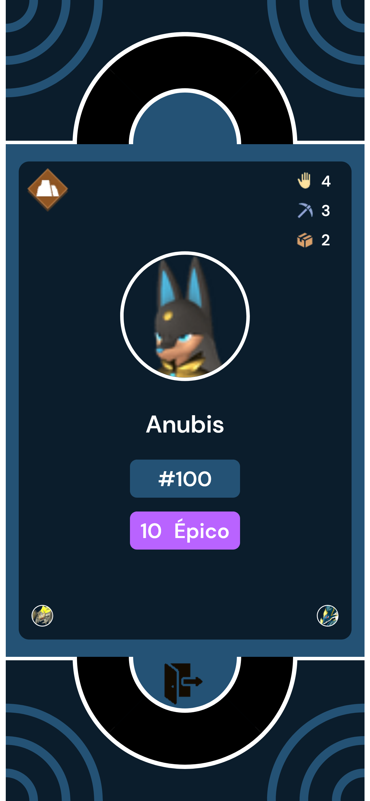

# 🎮 Enciclopédia Interativa de Palworld - HTML5

[](LICENSE)
[](https://developer.mozilla.org/en-US/docs/Web/HTML)
[](https://seu-usuario.github.io/seu-repositorio)

Uma enciclopédia web sobre os monstros de Palworld, desenvolvida em HTML5 puro com CSS3 e JavaScript.

## 🌟 Destaques do Projeto

- ✔️ Design responsivo que funciona em qualquer dispositivo (foco no mobile)
- ✔️ Galeria interativa de monstros

## 🖼️ Screenshots

<div align="center">
  
  
  
</div>

## 🛠️ Estrutura do Projeto
```
palpedia/
├── index.html
├── assets/
│ ├── css/
│ ├── js/
│ └── img/
├── screenshots/ 
└── README.md
```

